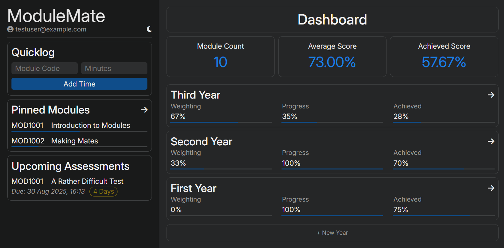

# ModuleMate

A Ruby on Rails web app that helps students track study time, manage upcoming exams, record scores, and calculate final grades. Built to replace the fragmented spreadsheets I used in my first two years at university, but available to all.  

Try the app live: [ModuleMate](https://modulemate.app)



## Features

- Track study sessions by module and duration
- Manage upcoming exams with dates, weightings and targets
- Record scores and automatically calculate weighted grades

## Getting Started

### Requirements

- Ruby 3.2.3
- Rails 7.2.2.2

### Setup

Clone and install dependencies:
```bash
git clone https://github.com/Turnlings/module-mate.git
cd module-mate
bundle install
```

Create a .env file:
```bash
touch .env
```

Add environment variables (replace values as needed):  
*Variables required to sign in with Google can be found at the [Google Cloud Console](https://console.cloud.google.com/)*
```env
DEVISE_SECRET_KEY=your_random_key_here
GOOGLE_CLIENT_ID=your_google_client_id
GOOGLE_CLIENT_SECRET=your_google_client_secret
POSTMARK_API_TOKEN=your_postmark_api_token
```

Set up the database:
```bash
rails db:create
rails db:migrate
```

Setup JS dependencies:
```bash
yarn install
bin/rails shakapacker:compile
```

Start the server:
```bash
rails s
```

## Contributing  
Contributions are welcome!  
1. Fork the repository  
2. Create a new branch (`git checkout -b feature/your-feature-name`)  
3. Commit your changes (`git commit -m 'Add some feature'`)  
4. Push to the branch (`git push origin feature/your-feature-name`)  
5. Open a Pull Request  
